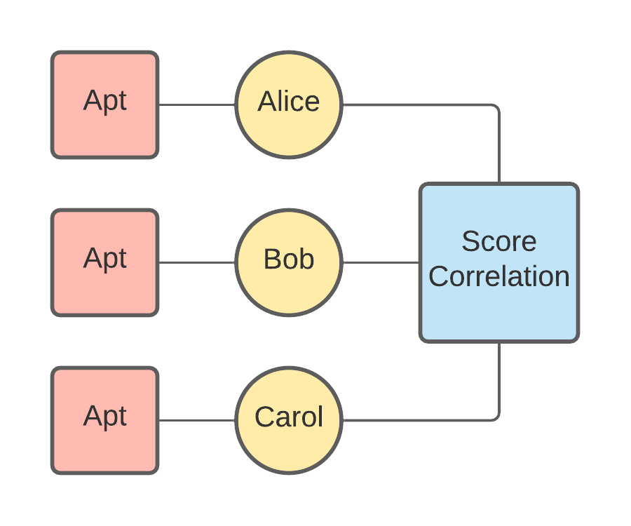
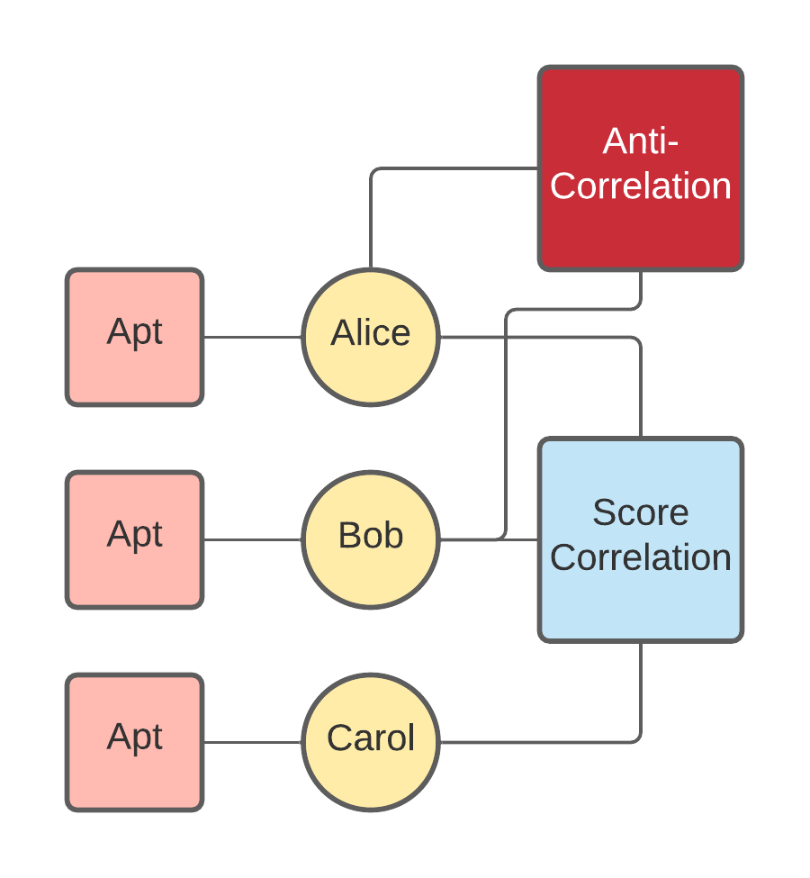

# PFG - The Python Factor Graph Library

`PFG` is a lightweight Python library for building and performing inference
on Factor Graphs. It is implemented in Python and all operations are
vectorized, so it runs extremely quickly. 
  
`PFG` can perform inference using the Belief Propagation algorithm. In the
case where factor graphs do not have a tree structure, `PFG` can perform the
Loopy Belief Propagation algorithm, which isn't guaranteed to converge but
usually gets good results in practice. When performing Loopy belief
Propagation, `PFG` also allows the user to create a schedule of factors, giving
complete control over the order in which messages are passed during inference.
      
## Installation

To install `PFG`, simply run the following command:

```
pip install pfg
```

## Usage

The following is taken from the file `example.ipnb` included within this
 repository:
 
### Building a Sample Factor Graph

A factor graph in this framework is composed of two primary classes of components: factors and variables.

**Factors** are the functions we use to compute our priors, and **Variables** represent the posterior probabilities we want to compute.

As an example, let's build a factor graph over student test scores on a 5-point exam. In this example, we are taking as our posterior the probability that a student gets a certain score. For the sake of our example, we're going to assume that scores are correlated with two different factors: the students aptitude, and, because the test may be more or less difficult, the scores of the other students.

To begin, let's import everything we will need and create an empty `FactorGraph` object.


```python
from pfg.factor_graph import FactorGraph, Variable, Factor, FactorCategory
import numpy as np
import pprint

fg = FactorGraph()
```

#### Variables

We must then declare all of the variables that we will need. A `Variable` is defined by 2 things:

- A unique name. Uniqueness is important for indexing into the results after inference has been performed.
- A dimension. Factor graphs operate over discrete probability mass functions, and the dimension represents the number of possible states for the variable.

In this case, we will have three variables, each representing the three students.


```python
var_a = Variable('Alice', 5)
var_b = Variable('Bob', 5)
var_c = Variable('Carol', 5)
```

We have given each variable a dimension of 5, because there are 5 possible scores on the exam.

#### Factors

Now we must include the factors that will be used to compute the posteriors during inference. A `Factor` connects to some arbitrary number of variables, and it's important when declaring factors to keep the dimensions of the factor consistent with the variables it will connect to.

Specifically, a `Factor` must be declared with the following parameters:

- The values of the factor. This is a rank `N` tensor (i.e. `N` dimensional) where `N` is the number of variables that will be connected to the factor. The length of each dimension must match the length of the variable associated with that dimension.
- An optional name for the factor.
- an optional category for the factor. Categories are used for scheduling during loopy belief propagation. This will be discussed later in the document.

The first of the factors we will add is the aptitude of the students towards the material. This might be determined from, for example, their past grades.

There will be a separate factor for each student. Since the aptitude factor only connects to a single student, the value will be of shape `[5]`, to match the 5 possible scores a student can receive.

```python
factor_apt_a = Factor(np.array([0.05, 0.05, 0.3, 0.3, 0.3]), name='Aptitude_Alice')
factor_apt_b = Factor(np.array([0.2, 0.3, 0.3, 0.2, 0.0]), name='Aptitude_Bob')
factor_apt_c = Factor(np.array([0.2, 0.2, 0.2, 0.2, 0.2]), name='Aptitude_Carol')

fg.add_factor([var_a], factor_apt_a)
fg.add_factor([var_b], factor_apt_b)
fg.add_factor([var_c], factor_apt_c)
```

In this construction, the factors are probability distributions over the 5 possible test score values. Note that factors do not need to be normalized to 1, but doing so may improve numerical stability. 

In our example, Alice is a good student, being much more likely to score a 3 or better. Bob is a poor student, tending towards lower scores, and Carol is a new student for whom nothing is known, so she has a uniform prior over test scores.

After we create the factors, we add them to the graph by connecting each factor to its affiliated variable. Variables are automatically added to the graph when their factors are added, but they could have also been explicitly added using the `add_variable()` or `add_variables_from_list()` methods of the `FactorGraph` class.

We additionally add a factor the we connect to all the students. This is the "correlation factor", which indicates that all of the students scores are generally correlated. This could be because, for instance, the test was either easier or harder than other tests. We do this by creating a function `correlation_value(a, b, c)`, which takes in 3 possible test scores and returns the prior probability of seeing those scores. This function is then used to fill a tensor of shape `[5, 5, 5]` which models the factor of the student score correlations.

For the sake of this example, we will use a symmetric function that does not bias towards one student doing better than another.


```python
def correlation_value(a, b, c):
    return 1 - 0.1 * (abs(a - b) + abs(b - c) + abs(a - c))

corr_values = np.zeros([5, 5, 5])

for a in range(5):
    for b in range(5):
        for c in range(5):
            corr_values[a, b, c] = correlation_value(a, b, c)
          
print('Correlation Tensor:')
print(corr_values)
            
# ----------

corr_factor = Factor(corr_values, name='Correlation')

fg.add_factor([var_a, var_b, var_c], corr_factor)
```

    Correlation Tensor:
    [[[1.  0.8 0.6 0.4 0.2]
      [0.8 0.8 0.6 0.4 0.2]
      [0.6 0.6 0.6 0.4 0.2]
      [0.4 0.4 0.4 0.4 0.2]
      [0.2 0.2 0.2 0.2 0.2]]
    
     [[0.8 0.8 0.6 0.4 0.2]
      [0.8 1.  0.8 0.6 0.4]
      [0.6 0.8 0.8 0.6 0.4]
      [0.4 0.6 0.6 0.6 0.4]
      [0.2 0.4 0.4 0.4 0.4]]
    
     [[0.6 0.6 0.6 0.4 0.2]
      [0.6 0.8 0.8 0.6 0.4]
      [0.6 0.8 1.  0.8 0.6]
      [0.4 0.6 0.8 0.8 0.6]
      [0.2 0.4 0.6 0.6 0.6]]
    
     [[0.4 0.4 0.4 0.4 0.2]
      [0.4 0.6 0.6 0.6 0.4]
      [0.4 0.6 0.8 0.8 0.6]
      [0.4 0.6 0.8 1.  0.8]
      [0.2 0.4 0.6 0.8 0.8]]
    
     [[0.2 0.2 0.2 0.2 0.2]
      [0.2 0.4 0.4 0.4 0.4]
      [0.2 0.4 0.6 0.6 0.6]
      [0.2 0.4 0.6 0.8 0.8]
      [0.2 0.4 0.6 0.8 1. ]]]
    

Notice how the correlation tensor has value `1` at the indices `(i, i, i)` to indicate a preference for all scores the same, and has no values of `0`, since these would make those score combinations impossible. 

Having added all of our factors, our graph now looks like this:



Notice how the graph could actually be viewed as a tree, with the "correlation factor" as the root.

#### Inference

We finish by performing belief propagation (BP) to compute the posterior distributions using the factors we've constructed. There are two methods that can be run to perform belief propagation:

- `belief_propagation_iteration()`: This performs a single iteration of belief propagation, according to the defined schedule (schedules will be explained in the next section. The schedule defaults to the order in which factors were added). For a general graph, it is not possible to use the belief propagation algorithm to compute the exact posteriors of the distribution. That said, good approximations are possible, and often multiple iterations of BP can yield better results. In practice, therefore, one would usually call this multiple times.
- `belief_propagation_tree()`: If the factor graph is actually a tree (as our graph is), then an exact solution to the posterior distribution is possible. In that case, this method can be called to achieve an exact solution in a single iteration.


```python
fg.belief_propagation_tree()
```

After the belief propagation is performed, the posteriors for the variables can be queried all at once or individually.


```python
print('All Posteriors:')
pprint.pprint(fg.posterior_for_all_variables())

print()
print('Posterior for Alice:')
print(fg.posterior_for_variable(var_a))
```

    All Posteriors:
    {'Alice': array([0.04666667, 0.05777778, 0.35777778, 0.31333333, 0.22444444]),
     'Bob': array([0.13703704, 0.28888889, 0.34444444, 0.22962963, 0.        ]),
     'Carol': array([0.15407407, 0.20962963, 0.23925926, 0.22444444, 0.17259259])}
    
    Posterior for Alice:
    [0.04666667 0.05777778 0.35777778 0.31333333 0.22444444]
    

Note how Alice's chance of getting a higher score has gone down. this is because the other students are less likely to do well, and we have constrained all of the scores to be positively correlated. 

### Scheduling

As mentioned above, the BP algorithm is not guaranteed to converge for general undirected graphs. In fact, there are scenarios where you will get different results depending on the order of message passing between variables and factors.

To handle this, the `pfg` library allows you to optionally set a schedule for belief propagation. This is done through the use of the `FactorCategory` class. A `FactorCategory` instance is essentially just a unique identifier for a set of `Factor`s. A schedule can then be composed as a list of `FactorCategory` instances. Factor categories are useful in that they allow associated but disparate factors to be grouped together (e.g. the "aptitude" factors in our example).

To explain using a simple example, we first rebuild the previous factor graph, this time assigning each factor to a category. To make this example a little more complicated and break the tree structure, we add a third "anti-correlation" factor between Alice and Bob, indicating that if one does better on the exam, the other is likely to do worse.


```python
# New categories for factors to use in scheduling
apt_factor_category = FactorCategory('Aptitude')
corr_factor_category = FactorCategory('Correlation')
anticorr_factor_category = FactorCategory('Anti-Correlation')

# ------- Identical to above calls, but with categories --------

fg = FactorGraph()

var_a = Variable('Alice', 5)
var_b = Variable('Bob', 5)
var_c = Variable('Carol', 5)

factor_apt_a = Factor(np.array([0.05, 0.05, 0.3, 0.3, 0.3]), name='Aptitude_Alice', 
                      category=apt_factor_category)
factor_apt_b = Factor(np.array([0.2, 0.3, 0.3, 0.2, 0.0]), name='Aptitude_Bob', 
                      category=apt_factor_category)
factor_apt_c = Factor(np.array([0.2, 0.2, 0.2, 0.2, 0.2]), name='Aptitude_Carol', 
                      category=apt_factor_category)

fg.add_factor([var_a], factor_apt_a)
fg.add_factor([var_b], factor_apt_b)
fg.add_factor([var_c], factor_apt_c)

corr_values = np.zeros([5, 5, 5])

for a in range(5):
    for b in range(5):
        for c in range(5):
            corr_values[a, b, c] = correlation_value(a, b, c)

corr_factor = Factor(corr_values, name='Correlation', category=corr_factor_category)

fg.add_factor([var_a, var_b, var_c], corr_factor)

# ----------- New factor to make schedule more interesting ---------

anticorr_values = np.zeros([5, 5])

for a in range(5):
    for b in range(5):
        anticorr_values[a, b] = 1. - correlation_value(a, b, a)

anti_corr_factor = Factor(anticorr_values, name='Anti-Correlation', category=anticorr_factor_category)
fg.add_factor([var_a, var_b], anti_corr_factor)
```

Our new graph looks as follows (note the lack of tree structure):



Now that we have put every factor into a category, we can create a schedule simply by indicating in what order we want to operate on the categories:


```python
fg.set_schedule([apt_factor_category, anticorr_factor_category, corr_factor_category])

fg.belief_propagation_iteration()

pprint.pprint(fg.posterior_for_all_variables())
```

    {'Alice': array([0.05511022, 0.0490982 , 0.27054108, 0.29458918, 0.33066132]),
     'Bob': array([0.2244898, 0.3      , 0.2755102, 0.2      , 0.       ]),
     'Carol': array([0.16923077, 0.21538462, 0.23076923, 0.21538462, 0.16923077])}
    
